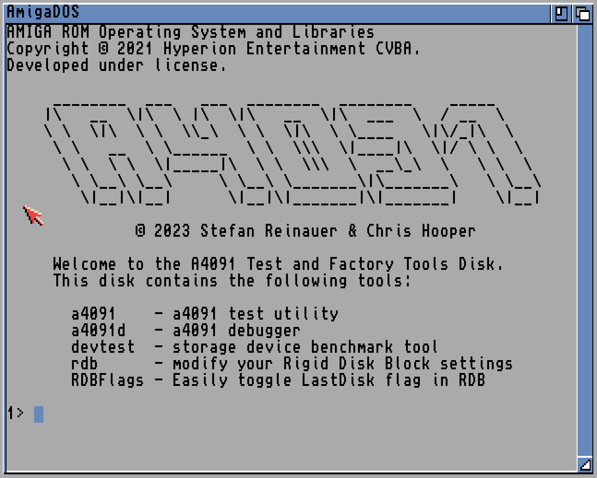
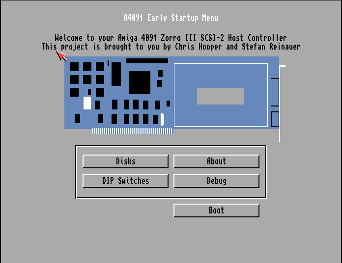

# A4091 Firmware & Factory Software

[](https://scan.coverity.com/projects/a4091-a4091-software)


## 📚 Table of Contents

- [How to Use This Driver](#-how-to-use-this-driver)
- [Architectural Overview](#-architectural-overview)
- [Configuration and Debugging](#-configuration-and-debugging)
- [Advanced ROM Customization](#advanced-rom-customization)
- [Internals](#internals)
- [Contributing and Support](#contributing-and-support)


This package contains the open-source firmware for the (Re)A4091 Zorro III Advanced SCSI-2 disk controller. This includes the AmigaOS device driver, the AutoConfig™ ROM, a command-line test utility, and a driver debug tool.

---

## How to Use This Driver

This section provides instructions for users who want to build and install the A4091 driver.

### 💾 Downloading a Release

Pre-built releases of the driver, ROM images, and tools are available from the project's GitHub page: [https://github.com/A4091/a4091-software/releases](https://github.com/A4091/a4091-software/releases)

### 🛠️ Building From Source

Building the software is a straightforward process. You will need a modern `m68k-amigaos-gcc` cross-compiler toolchain, such as [Bebbo's amiga-gcc](https://github.com/amiga-gcc/amiga-gcc).

**Compile the Software**

Simply run the `make` command from the root of the repository:

```bash
make
```

The build process is fully automated. The first time you run `make`, it will automatically download and initialize the necessary code libraries (git submodules) before compiling the project.

To see the full compiler output, which can be useful for troubleshooting, run `make verbose`.

This will produce several files:

| File                 | Description                                                                          |
| -------------------- | ------------------------------------------------------------------------------------ |
| `a4091.device`       | The AmigaOS device driver, which can be loaded from disk.                              |
| `a4091.rom`          | The AutoConfig™ ROM image to be written to an EPROM or EEPROM. This includes the driver. |
| `a4091_cdfs.rom`     | A ROM image with added CD-ROM boot support.                                          |
| `a4091_nodriver.rom` | A ROM image without the driver, useful for diagnostics or loading the driver from disk. |
| `a4091`              | A command-line utility to probe and test the A4091 card.                               |
| `a4091d`             | A debugging tool to inspect the internal state of the running driver.                  |

**Creating a Floppy Disk Image**

An Amiga Disk File (ADF) containing the driver and tools can be created from the `disk` directory:

```bash
cd disk
make
```

This will generate a bootable `.adf` file that can be written to a floppy disk. It contains some documentation and tools useful for your A4091.

### 💾 What's on the Disk

The A4091 floppy disk is bootable and contains several useful tools and documentation:

| File              | Description                                                                    |
| ----------------- | ------------------------------------------------------------------------------ |
| `A4091.guide`     | Comprehensive AmigaGuide documentation covering installation, configuration, and usage |
| `a4091.device`    | The AmigaOS device driver that can be loaded from disk if not using ROM version |
| `a4091`           | Command-line utility for testing and diagnosing the A4091 hardware           |
| `a4091d`          | Debug tool to inspect the internal state of the running a4091.device driver  |
| `devtest`         | Storage device benchmark and testing tool for any Amiga device               |
| `rdb`             | Utility for modifying Rigid Disk Block (RDB) settings on hard drives        |
| `RDBFlags`        | Tool to easily toggle the LastDisk flag in the RDB                           |
| `scsifix`         | Tool to redirect `2nd.scsi.device` calls to `a4091.device` for compatibility |



The disk boots automatically and displays a welcome screen with available tools. All utilities can be run from the shell and include built-in help via the `-h` or `?` options.

### ⚡ Flashing the ROM

The A4091 ROM can be written to a 32KB or 64KB EPROM or EEPROM. For the ReA4091, a **Winbond W27C512 EEPROM** is recommended. The 64KB size allows for the inclusion of a CDFileSystem for CD-ROM booting.

Use a standard EPROM programmer to write the `.rom` file to the chip.

---

## 🏛️ Architectural Overview

The A4091 firmware is a sophisticated piece of software designed to bridge the Amiga's operating system with the SCSI hardware. It involves a multi-stage process that begins at the earliest stages of the Amiga's boot sequence.

### The AutoConfig™ ROM and Boot Process

The journey begins with `rom.S`, a critical piece of assembly code that lives in the A4091's EEPROM. This file serves two primary purposes:

1.  **AutoConfig™ Data**: It contains the necessary identification data that AmigaOS uses to recognize the A4091 card on the Zorro III bus during the initial boot-up. This allows the system to "autoconfigure" the card and make it available.
2.  **Driver Loading**: Because the Amiga 3000 and 4000 read from the Zorro III ROM in nibbles (4-bit chunks), it's not possible to execute code directly from the EEPROM. Instead, `rom.S` acts as a bootloader. It finds the main driver (`a4091.device`), which is also stored in the ROM, and copies it into the Amiga's main RAM.

This loading process involves two key components, also written in assembly:

* **Relocator**: Once in RAM, the driver's code needs to be adjusted so that all its internal memory references point to the correct locations in RAM. The relocator code handles this task, making the driver executable.
* **RNC Decompressor**: To save precious space in the 64KB ROM, the `a4091.device` driver is compressed using the **RNC Pro-Pack** algorithm. A small, fast RNC decompressor, written in hand-optimized 68k assembly, is included to unpack the driver into its final, executable form in RAM.

### ROM Access Internals

The A4091 uses an 8-bit wide ROM. On Zorro III systems like the Amiga 3000 and 4000, ROM access is limited to nibble-wide reads during the AutoConfig™ phase. Because of this limitation, it is not possible to execute driver code in place from ROM.

To address this, the ROM code relocates the compressed driver image into main RAM, decompresses it using the built-in RNC decompressor, and then performs relocation on code and data pointers. This approach results in a boot process that is both compatible with the hardware and faster due to RAM execution speed.

This relocation and decompression is handled by hand-optimized assembly routines in `rom.S`, `reloc.S`, and `rnc.S`, and is a core component of the early boot logic.

### Boot Menu

The A4091 ROM includes an optional boot-time diagnostic and configuration menu. You can access it by holding down the **right mouse button** during power-up or reset.

The boot menu allows configuration of firmware features and diagnostics. It includes:

- ✔️ **CD-ROM Boot Enable/Disable**: Controls whether the controller attempts to boot from a CD.  
- ✔️ **Ignore `RDBFF_LAST`**: Allows the system to scan all drives even if one RDB flags it as final. Useful if a misconfigured or defective drive prevents other drives from being detected.
- 📜 **SCSI Device Summary**: Displays all detected SCSI targets, gathered by the driver.
- 🎛️ **DIP Switch Viewer**: Shows the current DIP switch configuration for the controller.

⚙️ These firmware options can be saved across reboots using the Amiga's **battery-backed memory (battmem)**.



The menu is implemented in `bootmenu.c` and invoked automatically if a right-click is detected during early boot.


### Source Code Origins

The A4091 driver is a hybrid, combining a robust, battle-tested SCSI core with Amiga-specific code.

* **From NetBSD**: The core of the driver, responsible for handling the low-level SCSI protocol and managing the **NCR 53c710** controller chip, is derived from the NetBSD open-source operating system. These files provide a solid foundation for SCSI communication:
    * `ncr53cxxx.*`
    * `siop.*`
    * `scsipi*.*`
* **Unique to A4091**: The following files are custom-written for this project and handle the integration with AmigaOS, the AutoConfig process, and the user-facing tools:
    * `rom.S`: The aforementioned ROM bootloader.
    * `device.c`: The main entry point and interface for the AmigaOS device driver.
    * `attach.c`: Code to handle attaching the driver to the system.
    * `cmdhandler.c`: Manages the command queue for the driver.
    * `a4091.c` and `a4091d.c`: The source for the `a4091` test utility and `a4091d` debug tool.
    * `mounter.c`: Code to automatically mount filesystems from the ROM.

### The Mounter

A key component for ease of use is the **mounter**. It is included in the ROM and is responsible for mounting hard drives at boot time, using the filesystems stored in Kickstart or the ROM (like `CDVDFS` or `fat95`).

After the main driver is running, the mounter scans the A4091 ROM for any embedded filesystem drivers. When it finds one, it automatically performs the necessary steps to mount it, so the user doesn't have to manually run any commands. This is what allows for seamless booting from a CD or automatic access to FAT-formatted drives.

The mounter is developed as a separate project that is used by other projects (like **[lide.device](https://github.com/LIV2/lide.device)**). You can find its source code and more details on its own GitHub repository: **[github.com/A4091/mounter](https://github.com/A4091/mounter)**.

---

## 🔧 Configuration and Debugging

### Using the `a4091` Test Utility

The `a4091` utility is a powerful command-line tool for testing and diagnosing the A4091 SCSI controller, especially for verifying a newly built card. To perform a comprehensive hardware test, run this from the Amiga Shell:

```bash
a4091 -t
```

This will test the card's registers, data/address pins, interrupts, and SCSI pins. A successful run is a good sign that the hardware is working correctly.

Additional options:

```bash
a4091 -t -L
```

Runs all tests in a continuous loop, counting how many passes have completed. This is useful for burn-in testing—500+ passes are recommended for validating new builds.

```bash
a4091 -t56
```

Runs only test numbers 5 and 6. You may specify any subset of test numbers 0 through 8 after `-t`. **Note:** Skipping a failing test may cause subsequent tests to behave unpredictably.

### Using the `a4091d` Debug Utility

The `a4091d` utility provides a "behind-the-scenes" look at the internal state of the `a4091.device` driver. Run it from the Shell to get a snapshot of the driver's status.

```bash
a4091d
```

You can specify what information to display:

* `d`: Show device information.
* `u`: Show unit (SCSI device) information.
* `o`: Show open information.
* `c`: Show command information.
* `a`: Show all information (default).

Example to show only unit and command info:

```bash
a4091d uc
```

### Enabling Debug Output

For advanced debugging, you can enable serial output by uncommenting various `-DDEBUG_...` flags in the `Makefile`. These messages are sent to the Amiga's serial port (9600 baud, 8-N-1).

---

## Advanced ROM Customization

### Using a Different CD-ROM Filesystem (AmigaOS `CDFileSystem`)

By default, the ROM is built with the **CDVDFS** filesystem from AROS. You can replace it with the official `CDFileSystem` from AmigaOS 3.2 (or other versions).

**Step 1: Extract `CDFileSystem` from the AmigaOS Install Disk**

Use `xdftool` (from `amitools`) to extract the filesystem from your AmigaOS Install ADF:

```bash
xdftool AmigaOS-3.2-Install.adf unadf L/CDFileSystem
```

**Step 2: Replace the Filesystem in the ROM**

Use the `romtool` utility (built with the project) to replace the first filesystem in the ROM. The filesystem type for `CDFileSystem` is `CD01` (hex `0x43443031`).

```bash
./romtool a4091.rom -o a4091_custom.rom -F CDFileSystem -T 0x43443031
```

The resulting `a4091_custom.rom` can be flashed to your EEPROM.

### 💾 Adding FAT32/MS-DOS Filesystem Support (`fat95`)

You can add support for reading PC-formatted FAT16/FAT32 drives by adding the `fat95` filesystem to the ROM.

**Step 1: Download the `fat95` Filesystem**

Download the `fat95` archive from **[Aminet](https://aminet.net/package/disk/misc/fat95)** and extract the `fat95` file from the `l/` directory of the archive.

**Step 2: Compile the ROM with Disk Label Support**

To use a second filesystem, you must compile the ROM with the `-DDISKLABEL` flag.

```bash
make CFLAGS=-DDISKLABEL
```

**Step 3: Add `fat95` to the ROM's Second Slot**

Use `romtool` to add `fat95` to the second filesystem slot (`-F2`). The filesystem type for `fat95` is `FAT` (hex `0x46415420`).

```bash
./romtool a4091.rom -o a4091_fat95.rom -F2 fat95 -T2 0x46415420
```

This universal ROM will use the default CD-ROM driver for CDs and automatically use `fat95` to mount any hard drive or Zip disk with a FAT partition. This can even enable booting from a FAT-formatted drive.

---

## 🤝 Contributing and Support

Feedback, pull requests, and issue reports are welcome at [github.com/A4091/a4091-software](https://github.com/A4091/a4091-software). If you're unsure where to start, browse the open issues or join the discussion on the project's GitHub page.

If you are using the A4091 and find a bug, please include as much detail as possible — including ROM version, Kickstart version, and any SCSI devices connected.
